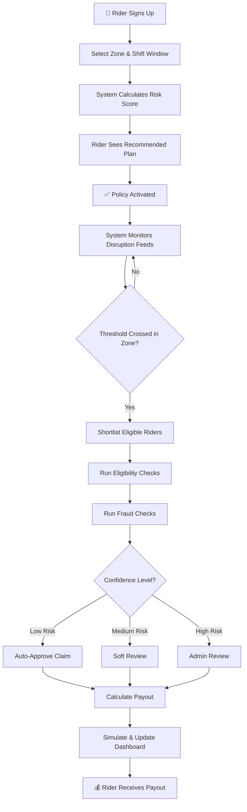
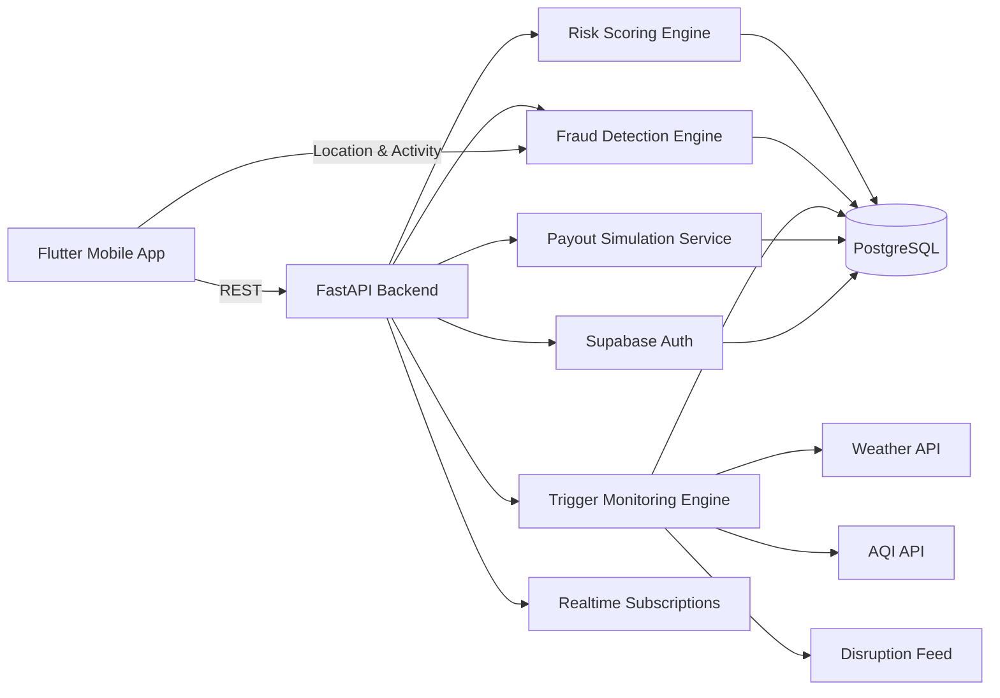

# Param Setu

> **Mobile-first parametric insurance for food delivery riders** — automatic income protection when external disruption strikes.

**📹 Phase 1 Demo:** [Watch here](https://drive.google.com/drive/folders/1arCwVFGw_CmgI0mQX2kPyofoJNe0fPl4?usp=sharing)

---

## Quick Overview

| Aspect | Details |
|--------|---------|
| **What** | Automatic income protection tied to measurable disruption (rain, flood, heat, pollution, access blocks) |
| **For** | Food delivery riders in Chennai (Swiggy, Zomato) |
| **How** | Parametric claim automation — no slow manual claims process |
| **Pricing** | Weekly micro-premiums (₹19–₹45/week) with zone-based risk adjustment |
| **Target** | Riders earning week-to-week who lose income during disruption windows |

---

## Table of Contents

- [The Problem](#the-problem)
- [How It Works](#how-it-works)
- [Pricing & Plans](#weekly-pricing-model)
- [Triggers & Payouts](#disruption-triggers)
- [Fraud Prevention](#fraud-prevention)
- [Tech Stack](#tech-stack)
- [Next Steps](#development-phases)

---

## The Problem

Food delivery riders live paycheck-to-paycheck, week-to-week. Missing one shift window isn't just bad luck — it's directly lost income.

**When disruption hits in Chennai:**
- Heavy rain
- Flooding and waterlogging  
- Extreme heat
- Severe air pollution
- Zone closures and mobility restrictions

**The result:** Riders stay "available" on the app but complete far fewer deliveries.

### Why traditional insurance fails

Traditional insurance is:
- **Too broad** — Designed for rare, catastrophic events, not weekly income drops
- **Too slow** — Manual claims take weeks; riders need income now
- **Too heavy** — Claims require proof and documentation; gig workers can't wait
- **Built for annuals** — Annual policies don't match weekly earning patterns

What's missing: **A lightweight, automatic, mobile-first protection layer built around how riders actually work.**

---

## Chosen Persona

We focused on **food delivery riders in Chennai** — specifically those working on Swiggy and Zomato.

This is intentional. Food delivery is one of the clearest loss-of-income cases:
- Riders work outdoors
- Income depends on short, predictable shift windows
- Weather directly affects order completion
- The impact is immediate and measurable

### Meet Sujeet

**Sujeet, 24** — A delivery rider in Chennai.

- Earns most during lunch (12–3 PM) and evening (7–10 PM) shifts
- On heavy rain days, he stays online but completes 40% fewer deliveries
- A 2–3 day disruption week cuts his income noticeably
- He needs fast, simple protection, not insurance paperwork

**Param Setu is built for riders like Sujeet.**

---

## How It Works

**Parametric Insurance** = Automatic payouts without manual claims.

Instead of asking "Did you lose income?", the system asks:
> "Did an external disruption event cross the threshold in your insured zone while you were working?"

If yes → automatic claim → instant payout simulation.

---

## The Flow

**Rider:**  
Sign up → Select zone & shift → Get risk score → Activate policy → Receive alerts & payouts

**System:**  
Monitor disruption feeds → Cross threshold? → Map zones → Shortlist riders → Fraud check → Auto-claim → Simulate payout

### Workflow

## Optimized Onboarding

The app gets riders from sign-up to active protection **in minutes**, not forms.

1. Mobile number authentication
2. Rider profile setup
3. Platform selection (Swiggy/Zomato)
4. Insured zone selection (geo-picked on map)
5. Shift window selection (when they usually work)
6. Recommended plan display (zone-based risk)
7. Policy activation

---

## Weekly Pricing Model

**Why weekly?**  
Riders think in weekly cash flow, not annual policies. Matches how they earn.

### Base Plans

| Plan | Week | Daily Coverage |
|------|-----:|-----:|
| **Basic** | ₹19 | ₹250 |
| **Standard** | ₹29 | ₹400 |
| **Plus** | ₹45 | ₹600 |

*Prototype pricing — not final actuarial.*

### Risk Adjustment

Final premium depends on the rider's actual zone exposure:
- Operating zone (flood-prone, heat-heavy, etc.)
- Rainfall history
- Heat exposure
- AQI severity
- Disruption frequency
- Shift timing

**Result:** Hyperlocal weekly pricing. A rider in a low-risk zone pays less than one in a flood-prone area. More fair, more defensible.

---

## Disruption Triggers

**Specific, measurable conditions** that directly affect rider income.

| Trigger | Threshold |
|---------|-----------|
| **Heavy Rain** | >80mm/6hrs or >120mm/24hrs |
| **Flood** | Severity=HIGH or >30% roads inaccessible |
| **Extreme Heat** | Heat index >45°C or temp >40°C for 3h+ |
| **Air Pollution** | AQI >400 for 3h+ |
| **Access Block** | Closure flag=TRUE or mobility below threshold |

### Claim Eligibility

- Threshold crossed  
- Rider on active policy  
- Disruption zone matches insured zone  
- Rider active during affected shift  
- Fraud checks pass

---

## Payout Logic

**Simple rule:** Rider gets the daily coverage amount tied to their active plan.

| Plan | Daily Payout |
|------|-----:|
| Basic | ₹250 |
| Standard | ₹400 |
| Plus | ₹600 |

**Anti-gaming rules:**
- 1 payout per disruption window per rider
- No duplicate payouts for same zone + event window
- Capped by active plan limits

---
## Sample Scenario: How Sujeet Receives a Payout

**Setup:**  
Sujeet → Standard plan (₹29/week) → Insured zone: Chennai

**The Day:**  
Rainfall hits 85mm in 4 hours → Sujeet is active (evening shift) → Zone matches → Fraud checks pass

**What happens:**  
- Automatic claim created  
- ₹400 payout simulated  
- Payout shows in app within seconds

**End-to-End:** Trigger detected → Zone verified → Rider confirmed active → Fraud checks passed → Claim auto-created → Payout calculated and simulated

---

## AI / ML Integration

**No decoration.** AI is used only where it changes product decision-making.

### 1. Risk Scoring
**Input:** Zone history, rainfall, heat, AQI, disruption frequency, shift patterns  
**Output:** Weekly risk score → Recommended plan → Premium adjustment

### 2. Fraud Detection
**Input:** GPS location, app activity, claim frequency, device trust, movement patterns  
**Output:** Fraud confidence score → Auto-approve | Soft review | Admin flag

### 3. Predictive Insights (Admin)
**Input:** Historical claims, zone patterns, seasonal trends  
**Output:** Next-week risk forecast → Exposure concentration → Claim pressure alerts

**Philosophy:** Explainable models > black-box models. Riders and admins need to trust the logic.

---

## Fraud Prevention

**Core Assumption:** GPS alone won't work. Location can be spoofed.

**Better Question:** "Does this rider's full behavior look like someone genuinely disrupted?"

### What We Check

| Signal | Genuine | Spoofer |
|--------|---------|---------|
| Location | Consistent zone history | Sudden high-payout jumps |
| Activity | Active during disruption | Weak session evidence |
| Movement | Route continuity | Impossible travel |
| Timing | Overlaps real events | Mismatched timing |
| Device | Consistent device/IP | Emulator flags, IP switching |
| Claims | Normal frequency | Synchronized across accounts |

### Decision Process

**Low Risk** → Auto-approve  
**Medium Risk** → Soft review (rider can confirm in app)  
**High Risk** → Admin review (fraud signal)

**Core Principle:** No single signal unlocks payout. Confidence comes from agreement across all checks.

---

## Why Mobile-First

Riders live on their phones. Building for desktop would be artificial.

**Why Mobile:**
- Real-time access during live shifts
- Location validation is natural on mobile
- Alerts & payouts fit the app experience
- Matches how riders already use tools

**Building with Flutter** for one codebase → Android + iOS.

---

## Tech Stack

**Mobile:** Flutter (Dart) + Riverpod + GoRouter + Supabase SDK  
**Backend:** FastAPI (Python) + background jobs  
**Database:** Supabase (PostgreSQL) + Auth + RLS + Realtime  
**Intelligence:** Python + Pandas + scikit-learn + anomaly detection  
**Integrations:** Weather API | AQI API | Mobility feed | GPS validation

### Architecture

---

## Dashboards

### Rider Dashboard
Real-time view of protection status and claims.

**Key Metrics:**
- Active weekly plan (premium, daily protection limit)
- Insured operating zone & shift window
- Risk score for current zone
- Live claims triggered this week (date, reason, status)
- Payouts received & pending approval
- Total earnings protected this week

**Recent Activity:**
- Claims by date & disruption type
- Zone coverage validation (GPS last verified)
- Policy activation & renewal history

### Admin Dashboard
Operational visibility and fraud oversight.

**Zone Analytics:**
- Active policies by zone
- Risk score distribution (low/medium/high)
- Disruption frequency by zone & trigger type
- Premium revenue & payout exposure by area

**Claims & Risk:**
- Triggers fired (hourly, daily summary)
- Claims auto-created vs. in review
- Flagged & suspicious claims (admin queue)
- Fraud confidence score trends

**Business Metrics:**
- Weekly payout totals by plan
- Exposure concentration (zone clusters)
- Next-week risk forecast
- Claim approval rates by confidence band

---

## Development Phases

**Phase 1 — Foundation**  
Scope, pricing, triggers, architecture, README, demo flow

**Phase 2 — Core Product**  
Onboarding, policies, Supabase integration, risk scoring, trigger engine, auto-claims

**Phase 3 — Intelligence & Polish**  
Fraud detection, admin insights, payout simulation, claim visibility, final demo

---

## Summary

Param Setu is our attempt to build something narrow, honest, and actually usable.

The core idea is simple: if external disruption is measurable, then short-term income protection for riders should not depend on slow, manual, traditional claims logic. It should be mobile, lightweight, and responsive to real operating conditions.

That is what we are building.
